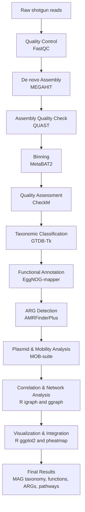

# 🧬 Metagenome-Assembled Genomes from Chicken Housing Environments
### **Bioinformatics Analysis Pipeline**

This repository contains the complete, reproducible workflow for the reconstruction, quality assessment, taxonomic classification, and functional characterization of **metagenome-assembled genomes (MAGs)** derived from the **layer chicken housing environment (dust and litter metagenomes)**.

The workflow integrates **assembly, binning, genome quality evaluation, taxonomic assignment, functional and antimicrobial-resistance (AMR) annotation, plasmid and mobility analysis,** and **data visualization**.  
All analyses were performed on the **University of Calgary ARC HPC** using conda environments.  
This pipeline can be adapted for other animal or environmental metagenomic datasets within a **One Health** framework.

---

## 🧩 Pipeline Overview



---

## 🧠 Project Details

This project investigates the **microbial and functional landscape** of layer chicken barn environments, focusing on **bioaerosols (air)** and **litter microbiomes** from **cage- and floor-housed systems**.  
Using shotgun metagenomic sequencing, the study reconstructs MAGs to explore **bacterial diversity, functional pathways, and antimicrobial resistance (ARGs)**.  

Key objectives:
- Reconstruct and classify MAGs from dust and litter samples  
- Identify bacterial hosts of ARGs  
- Explore metabolic pathways (e.g., ammonia, H₂S, nitrogen cycling) influencing barn air quality  
- Assess co-occurrence of ARGs with plasmids and mobile elements  
- Compare microbiome and resistome features between housing systems  

---

## 🧰 Tools and Dependencies

| Step | Tool | Version | Purpose |
|------|------|----------|----------|
| Quality Control | FastQC / Trimmomatic | 0.12.1 / 0.39 | Read QC and trimming |
| Assembly | MEGAHIT | 1.2.9 | Metagenomic assembly |
| Assembly QC | QUAST | 5.2.0 | Evaluate assembly quality |
| Binning | MetaBAT2 | 2.15 | Reconstruct MAGs |
| Quality Assessment | CheckM | 1.2.3 | Completeness & contamination |
| Taxonomy | GTDB-Tk | 2.3.0 | MAG taxonomic classification |
| Functional Annotation | EggNOG-mapper | 2.1.9 | Annotate proteins & functions |
| Pathways | HUMAnN3 | 3.0 | Map pathways & gene families |
| AMR Detection | AMRFinderPlus | 3.11.28 | Detect antimicrobial-resistance genes |
| Plasmids | PlasFlow / MOB-suite | 1.1 / 3.0.3 | Predict plasmids & mobility |
| Visualization | R (ggplot2, pheatmap, igraph) | 4.3.x | Plotting & network analysis |

---

## ⚙️ Example Commands
*(All commands executed on ARC HPC with 8–24 CPUs and 64–128 GB RAM.)*

<details>
<summary>🔹 Quality Control</summary>

```bash
fastqc *.fastq.gz -o fastqc_reports/
multiqc fastqc_reports/ -o multiqc_report/

trimmomatic PE -threads 8   sample_R1.fastq.gz sample_R2.fastq.gz   trimmed_R1.fastq.gz unpaired_R1.fastq.gz   trimmed_R2.fastq.gz unpaired_R2.fastq.gz   ILLUMINACLIP:adapters.fa:2:30:10   LEADING:3 TRAILING:3 SLIDINGWINDOW:4:20 MINLEN:50
```
</details>

<details>
<summary>🔹 Assembly & Quality Check</summary>

```bash
megahit -1 trimmed_R1.fastq.gz -2 trimmed_R2.fastq.gz   -o megahit_output --min-contig-len 1000 -t 16

quast.py megahit_output/final.contigs.fa -o quast_output -t 8
```
</details>

<details>
<summary>🔹 Depth Calculation & Binning</summary>

```bash
bowtie2-build megahit_output/final.contigs.fa bowtie_index
bowtie2 -x bowtie_index -1 trimmed_R1.fastq.gz -2 trimmed_R2.fastq.gz   -S mapped.sam -p 16
samtools view -bS mapped.sam > mapped.bam
samtools sort mapped.bam -o mapped_sorted.bam
jgi_summarize_bam_contig_depths --outputDepth depth.txt mapped_sorted.bam

metabat2 -i megahit_output/final.contigs.fa -a depth.txt -o bins/bin -t 16
```
</details>

<details>
<summary>🔹 MAG Quality & Taxonomy</summary>

```bash
checkm lineage_wf bins/ checkm_output -x fa -t 8
checkm qa checkm_output/lineage.ms bins/ -o 2 -f checkm_summary.tsv

gtdbtk classify_wf --genome_dir bins/ --out_dir gtdbtk_output --cpus 8
```
</details>

<details>
<summary>🔹 Functional & AMR Analysis</summary>

```bash
emapper.py -i proteins.faa --output emapper_out --cpu 8
humann --input sample.fastq.gz --output humann_output --threads 8
humann_renorm_table -i humann_output/genefamilies.tsv -u relab -o humann_output/genefamilies_relab.tsv
humann_join_tables --input humann_output/ --output humann_all_samples.tsv --file_name genefamilies_relab

amrfinder -n contigs.fa -o amr_results.tsv --threads 8
mob_recon -i contigs.fa -o mob_output -n 8
```
</details>

<details>
<summary>🔹 Visualization & Network Analysis (R)</summary>

```r
library(ggplot2)
library(pheatmap)
library(igraph)
library(ggraph)

checkm <- read.delim("checkm_summary.tsv")
ggplot(checkm, aes(x=Completeness, y=Contamination)) +
  geom_point(color="#0072B2", size=3) +
  theme_minimal() +
  labs(title="MAG Quality Assessment")

source("scripts/cooccurrence_network.R")
```
</details>

---

## 📂 Output Summary

| File | Description |
|------|--------------|
| `checkm_summary.tsv` | MAG completeness & contamination |
| `gtdbtk.bac120.summary.tsv` | MAG taxonomy |
| `amr_results.tsv` | Detected ARGs |
| `mob_output/` | MOB-suite plasmid mobility |
| `all_samples.tsv` | Functional pathways |
| `visualizations/` | R-generated plots (heatmaps, networks) |


---

## 📚 Citation

If you use this workflow or data, please cite:

> **Ghaffar, A.** *et al.* (2025). Exploring the indoor airborne microbiome and resistome in layer barns across Alberta, Canada. *Research in Veterinary Science*.  

---

## 👨‍🔬 Author

**Awais Ghaffar, PhD Candidate**  
Faculty of Veterinary Medicine, University of Calgary  
📧 [awais.ghaffar@ucalgary.ca](mailto:awais.ghaffar@ucalgary.ca)
